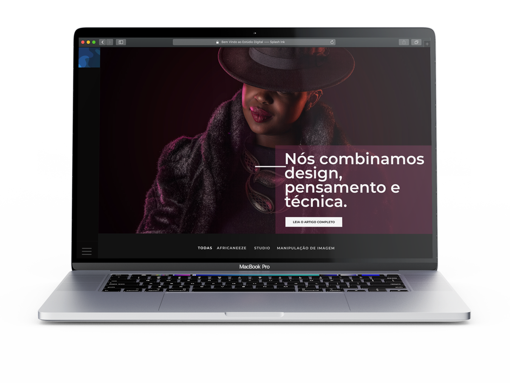

  

  
  
  
  

The official website repository for Digital Studio. Fell free to contribute by report an Issue or enhance by opening a new PR for issues labeled as `help wanted`. For more information about the further versions checkout the [Prototype](https://www.figma.com/proto/QDfbwTjcpjNhOYU0yYuSpRcH/Disparos-Digital-Studio?node-id=1%3A2&scaling=scale-down) for this website or follow the [milestones](https://github.com/splash-ink/studio.splashink.co/milestones) for each new major release.
